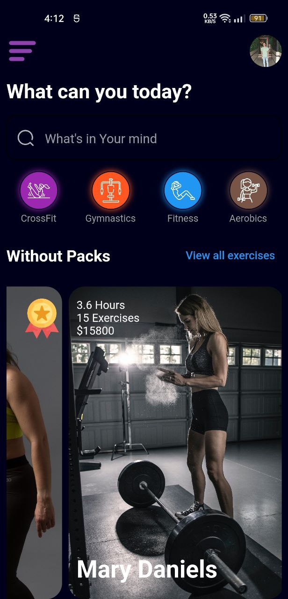

# Workout Hard App

This Flutter app provides a platform for users to access various workout routines and exercises. Users can view workout details, watch associated videos, and get started with their fitness journey.

## Table of Contents
- [Features](#features)
- [Screenshots](#screenshots)
- [Getting Started](#getting-started)
  - [Prerequisites](#prerequisites)
  - [Installation](#installation)
- [Usage](#usage)
- [Contributing](#contributing)
- [License](#license)

## Features

- View a list of available workout routines.
- View detailed information about a specific workout, including description and exercises.
- Watch instructional workout videos.
- Get started with a workout routine.

## Screenshots

| Home Screen |
| :------: | :----------: |
|  |  |

| WorkOut Details Screen |
| :------: | :----------: |
|  |  |


## Getting Started

### Prerequisites

- Flutter SDK: [Install Flutter](https://flutter.dev/docs/get-started/install)
- Dart SDK: [Install Dart](https://dart.dev/get-dart)

### Installation

1. Clone the repository:

   ```shell
   git clone https://github.com/your_username/your_repo.git
   cd your_repo/

## Usage
-Launch the app on your preferred mobile device or emulator.
-Explore the available workout routines and choose one to view details.
-Watch instructional videos to learn the exercises.
-Get started on your fitness journey!

## Contributing
Contributions are welcome! Feel free to open an issue or create a pull request.

## License

[MIT License](LICENSE)